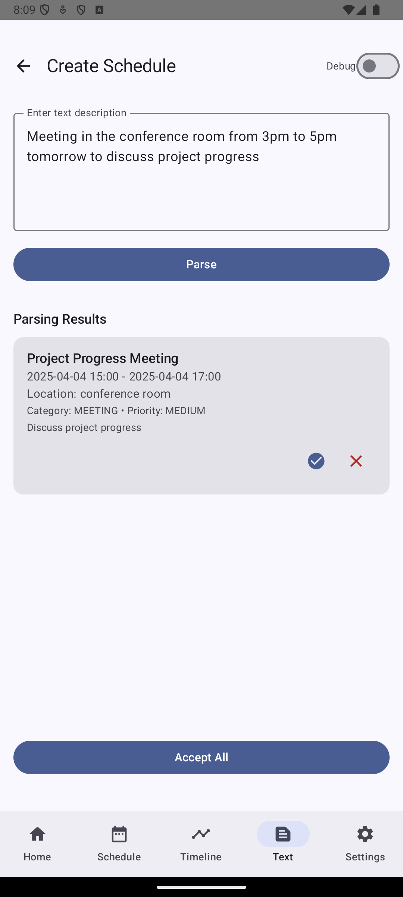
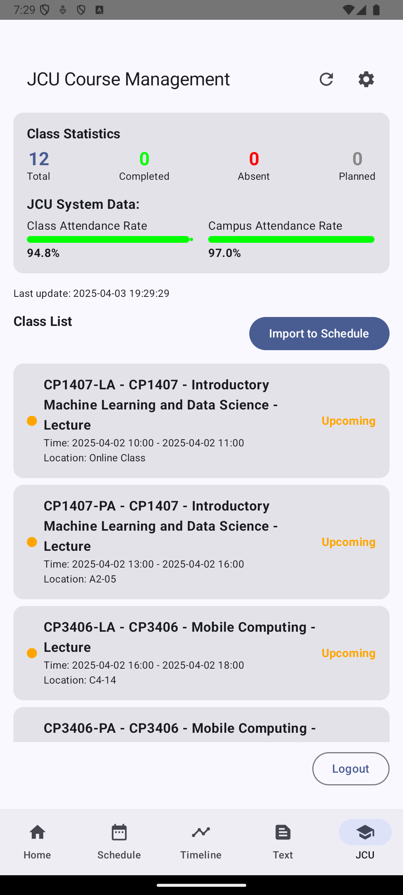
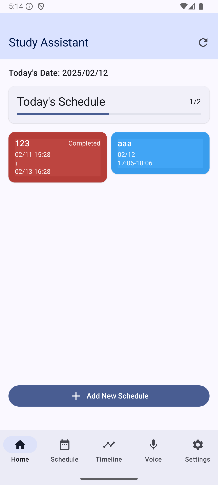
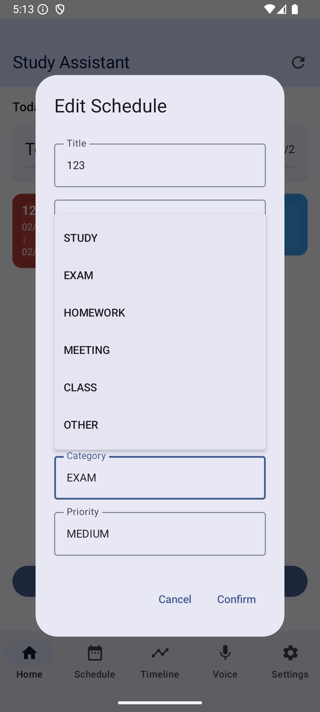
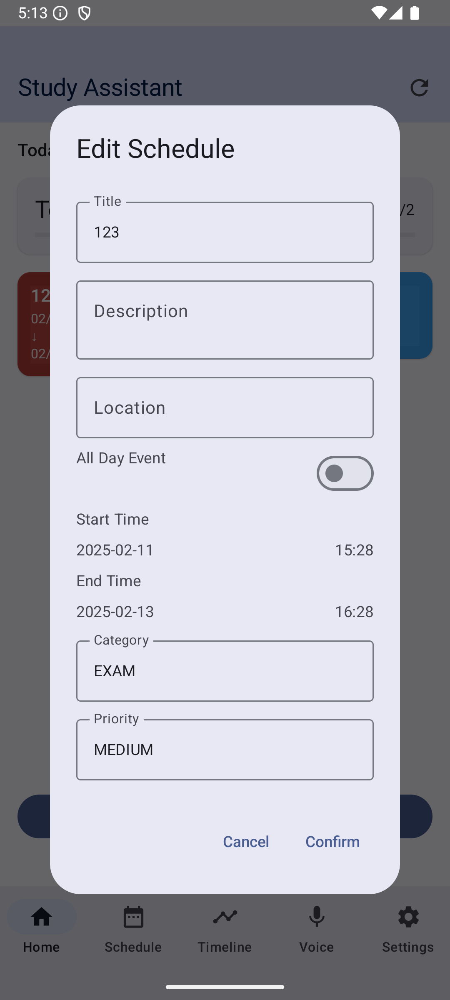
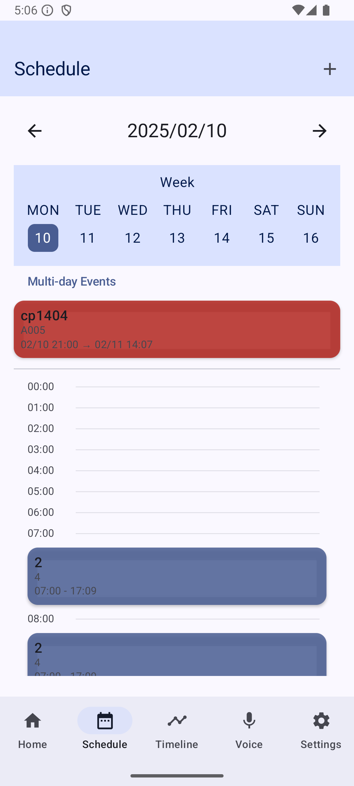
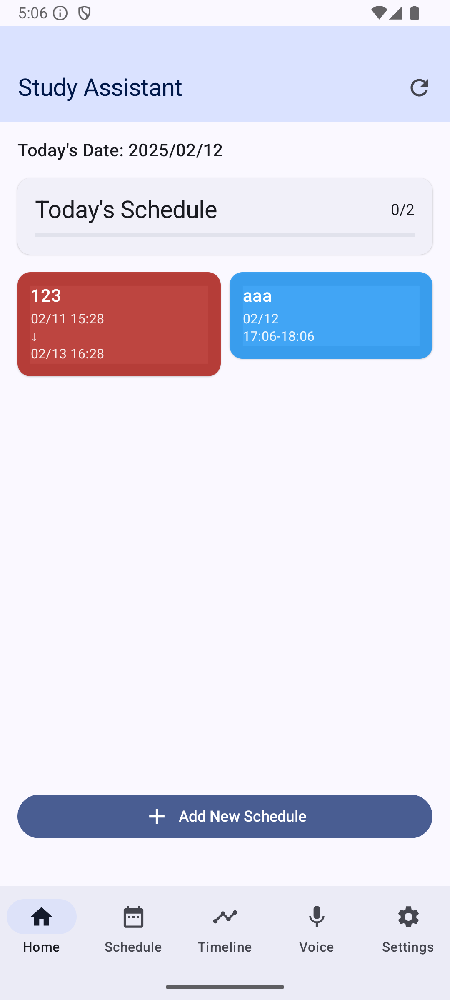
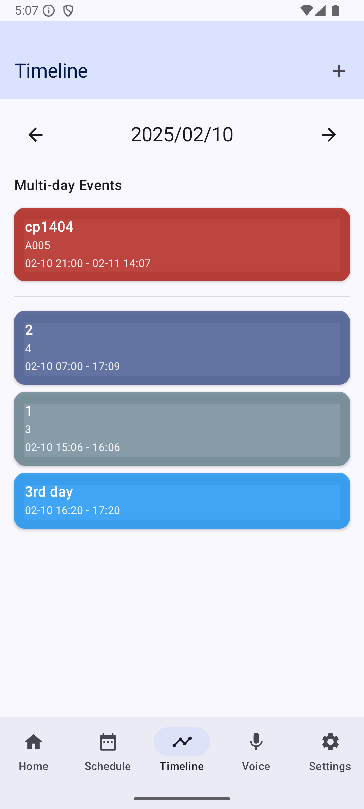

<!-- CP3406
Scenario 6: Student Study and Time Management App
Lisa is a busy college student balancing her academic responsibilities, part-time job, and social life.
She often finds herself overwhelmed by the sheer volume of tasks, assignments, and deadlines,
making it difficult to stay organized and focused. Despite her best efforts, she often misses deadlines
and struggles to prioritize what’s most important. Lisa feels that she needs a better way to manage
her time, set specific goals, and track her progress toward achieving both academic and personal
milestones. She wants an app that helps her break down her tasks, set clear study goals, and prioritize
her daily activities. The app should help Lisa visualize her workload, track her progress, and ensure
she maintains a healthy balance between studying, working, and enjoying her social life. -->

# Study Assistant - Mobile Application Presentation

---

# Major Updates

## 1. JCU Student System Integration

- Added JCU student account login functionality
- Support automatic course import from StudentFirst
- One-click import of class schedules to personal calendar

## 2. AI Smart Scheduling

- Integrated AI text processing capabilities
- Support automatic schedule generation through text descriptions

## 3. Feature Optimization

- Removed voice input functionality
- Optimized user interface and interaction experience
- Improved overall system performance and stability

    
    
    
    
    

---

## 0. Run the app

    
    
    

    
    
    
    

## 1. Problem Statement

### 1.1 Inefficient Time Management

#### 1.1.1 Time Management Challenges

- Students often struggle to allocate time efficiently due to numerous tasks, leading to low productivity
- The 2023 College Student Learning Behavior Report shows that 78% of students face difficulties in time management, causing significant academic stress (Gobena, 2024)

#### 1.1.2 Schedule Integration

- Students often struggle to integrate their academic and personal schedules effectively, leading to increased academic stress and a negative impact on their well-being (Zhang, 2023)
- Research indicates that poor schedule integration directly correlates with decreased academic performance and mental health issues (Zhang, 2023)

#### 1.1.3 Lack of Effective Tools

- Existing tools are mostly generic and lack optimization for academic use, leaving students in need of a specialized solution
- A survey of 200 students revealed that 85% feel there is a lack of effective tools to help them manage their academic schedules and tasks (Gobena, 2024)

## 2. Solution Overview

Our mobile application aims to help students like Lisa by providing:

### 2.1 JCU Integration

- Secure JCU account login and session management
- Automatic course retrieval from StudentFirst portal
- Course attendance statistics and analysis
- One-click import of classes to personal schedule

### 2.2 Intelligent Schedule Management

- Visual calendar interface with day/hours views
- Smart task prioritization with category system
- Natural language schedule creation (text to schedule)
- Duplicate prevention system

### 2.3 User Experience

- Fully localized English interface
- Intuitive calendar navigation
- Visual completion tracking
- Quick schedule creation and editing

## 3. Development Progress

### 3.1 Recent Updates

- **Complete UI Localization**: Translated all UI elements from Chinese to English
- **Enhanced JCU Integration**: Improved login process and data retrieval from JCU StudentFirst
- **Bug Fixes**:
  - Fixed database schema version issues
  - Addressed duplicate entry problems when importing JCU classes
  - Resolved deprecated API usage in UI components
- **APK Export**: Application successfully built into deployable APK

### 3.2 Current Features

- Secure JCU StudentFirst account integration
- Course schedule import and management
- Calendar visualization of schedules
- Smart text-based schedule creation
- Schedule categorization system
- Attendance statistics visualization

### 3.3 In Development

- AI-powered schedule optimization
- Voice assistant integration (Abor)
- Advanced analytics for study patterns

## 4. Technical Implementation

The application is built using:

- Kotlin for Android development
- Jetpack Compose for modern UI
- Room database for data persistence
- Jsoup for web scraping (JCU integration)
- AI integration for intelligent features (in progress)

## 5. Future Roadmap

In future releases, we plan to:

- ✅ Implement smarter AI-powered schedule suggestions
- ✅ Add study session tracking features
- ✅ Create performance insights dashboard
- ✅ Improve natural language processing capabilities

## 6. References

- Gobena, G. A. (2024). Effects of academic stress on students' academic achievements and its implications for their future lives. Anatolian Journal of Education, 9(1), 113-130. https://doi.org/10.29333/aje.2024.918a
- Zhang, T. (2023). A survey report on the current situation of academic stress among university students in the context of online teaching. Advances in Social Sciences, 12(7), 3678-3684. https://doi.org/10.12677/ass.2023.127503

## 7. Acknowledgements

I would like to thank the following individuals for their valuable contributions to the development of this application:

- Randy Zhu
- bsingha27 (https://github.com/PacktPublishing/Mastering-Kotlin-for-Android)
