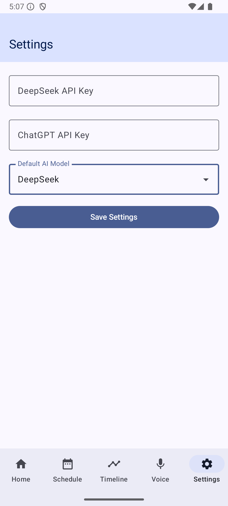

<!-- CP3406
Scenario 6: Student Study and Time Management App
Lisa is a busy college student balancing her academic responsibilities, part-time job, and social life.
She often finds herself overwhelmed by the sheer volume of tasks, assignments, and deadlines,
making it difficult to stay organized and focused. Despite her best efforts, she often misses deadlines
and struggles to prioritize what’s most important. Lisa feels that she needs a better way to manage
her time, set specific goals, and track her progress toward achieving both academic and personal
milestones. She wants an app that helps her break down her tasks, set clear study goals, and prioritize
her daily activities. The app should help Lisa visualize her workload, track her progress, and ensure
she maintains a healthy balance between studying, working, and enjoying her social life. -->

# Study Assistant - Mobile Application Presentation

## 0. Run the app

## 1. Problem Statement

### 1.1 Inefficient Time Management

#### 1.1.1 Time Management Challenges

- Students often struggle to allocate time efficiently due to numerous tasks, leading to low productivity
- The 2023 College Student Learning Behavior Report shows that 78% of students face difficulties in time management, causing significant academic stress (Gobena, 2024)

#### 1.1.2 Schedule Integration

- Students often struggle to integrate their academic and personal schedules effectively, leading to increased academic stress and a negative impact on their well-being (Zhang, 2023)
- Research indicates that poor schedule integration directly correlates with decreased academic performance and mental health issues (Zhang, 2023)

#### 1.1.3 Lack of Effective Tools

- Existing tools are mostly generic and lack optimization for academic use, leaving students in need of a specialized solution
- A survey of 200 students revealed that 85% feel there is a lack of effective tools to help them manage their academic schedules and tasks (Gobena, 2024)

## 2. Solution Overview

Our mobile application aims to help students like Lisa by providing:

### 2.1 Intelligent Schedule Management

- AI-powered schedule optimization (TODO)
- Smart task prioritization
- Automated reminders and notifications (TODO)

### 2.2 Study Tracking System

- Real-time study session monitoring
- Progress analytics and insights
- Performance tracking and recommendations

### 2.3 Voice Assistant Integration

- Hands-free task management
- Voice-controlled scheduling
- Natural language processing for easy interaction

## 3. Key Features

### 3.1 Schedule Management

- Visual calendar interface
- Drag-and-drop task organization
- Conflict detection and resolution

### 3.2 Study Analytics

- Detailed study statistics
- Progress visualization
- Performance insights

### 3.3 AI Assistant (TODO)

- Smart task suggestions
- Schedule optimization
- Personalized study recommendations

## 4. Technical Implementation

The application will be built using:

- Kotlin for Android development
- Jetpack Compose for modern UI
- Room database for data persistence
- AI integration for intelligent features (TODO)

## 5. Expected Impact

By implementing these features, we aim to help students:

- Improve time management skills
- Reduce academic stress
- Increase productivity
- Maintain better work-life balance

## 6. Conclusion

Our mobile application, Study Assistant, is designed to address the common challenges faced by students in managing their time and tasks effectively. By leveraging AI and modern mobile technologies, we aim to provide a user-friendly and intelligent solution that helps students stay organized, focused, and balanced.

## 7. References

- Gobena, G. A. (2024). Effects of academic stress on students' academic achievements and its implications for their future lives. Anatolian Journal of Education, 9(1), 113-130. https://doi.org/10.29333/aje.2024.918a
- Zhang, T. (2023). A survey report on the current situation of academic stress among university students in the context of online teaching. Advances in Social Sciences, 12(7), 3678-3684. https://doi.org/10.12677/ass.2023.127503

## 8. Acknowledgements

I would like to thank the following individuals for their valuable contributions to the development of Study Assistant:

- Randy Zhu

- bsingha27 (https://github.com/PacktPublishing/Mastering-Kotlin-for-Android)